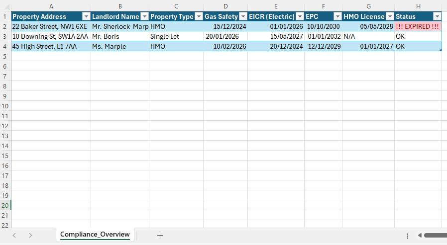
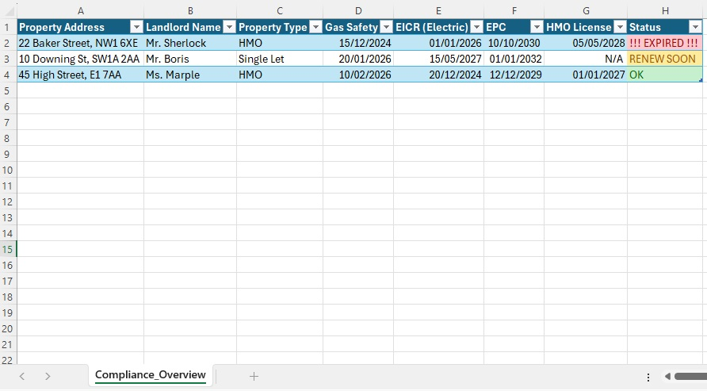
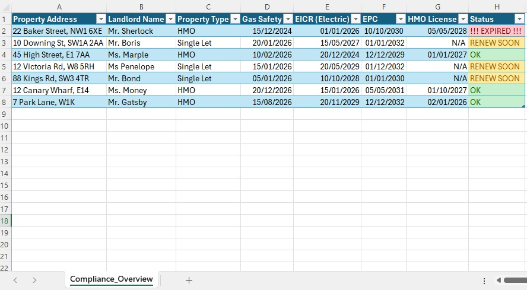

# Automated-Property-Compliance-Revenue-Tracker-Overview
Project Overview: I have developed an Excel-based management system to track essential legal documentation for a London-based property portfolio. The primary goal was to ensure 100% compliance with UK housing regulations, including Gas Safety, EICR, EPC, and HMO licensing.

Key Features:
•	Automated Status Tracking: Implemented nested IF and TODAY() functions to automatically categorise the status of each certificate.
•	Risk Mitigation (Proactive Alerts): Integrated a 3-tier Conditional Formatting system:

•	RED: Immediate action required (Expired).

•	YELLOW: Proactive warning (Expiring within 30 days).

•	GREEN: Fully compliant.

•	Scalable Architecture: Utilised Excel's "Format as Table" feature to allow the system to automatically apply logic and formatting to new property entries.
Outcome: This tool eliminates manual oversight and significantly reduces the risk of legal penalties for the agency. It provides a clear, real-time overview of the portfolio’s legal health and performance.

1. Automatic Expiry Alert

2. Proactive Monitoring (30-day warning)

3. Automated Portfolio Overview

